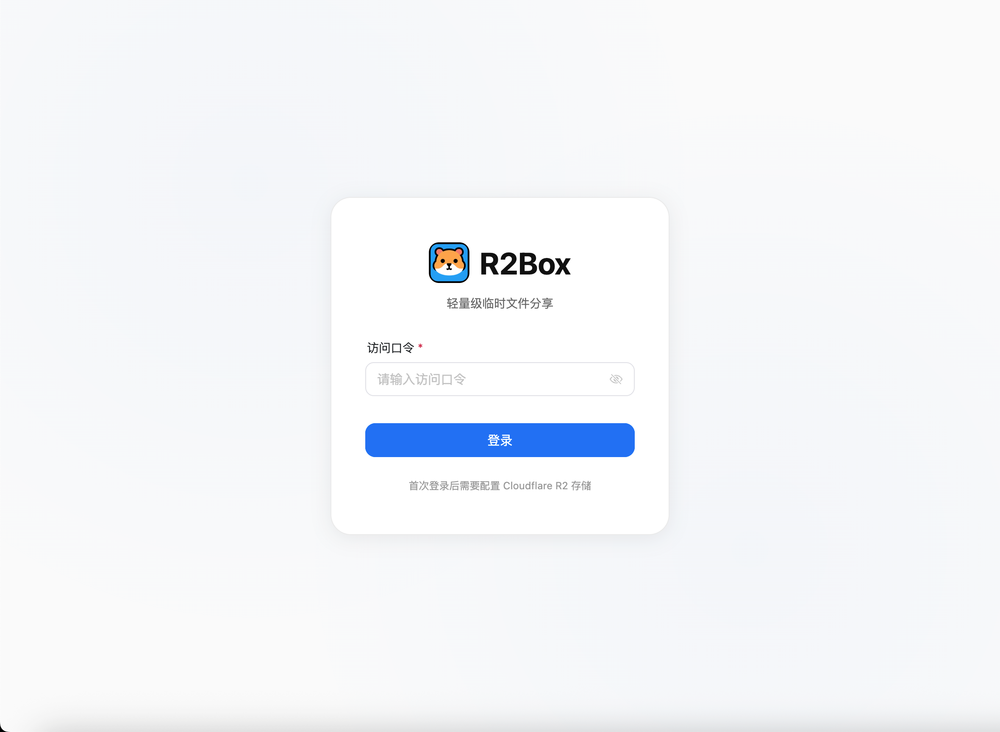
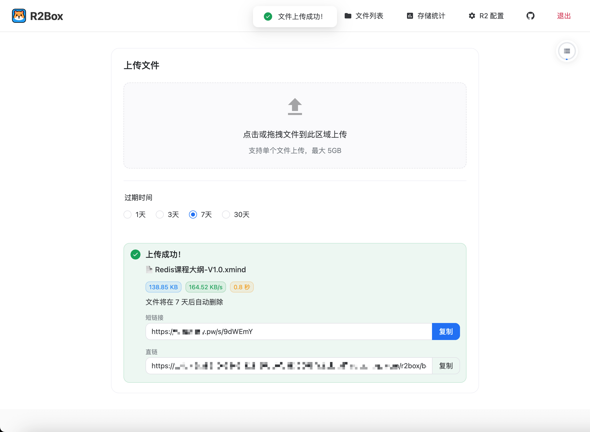
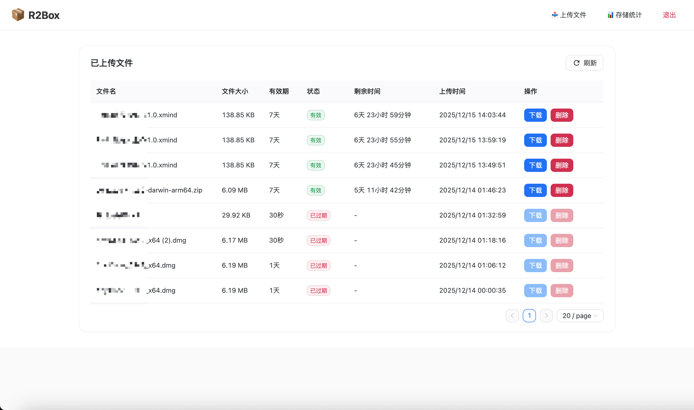
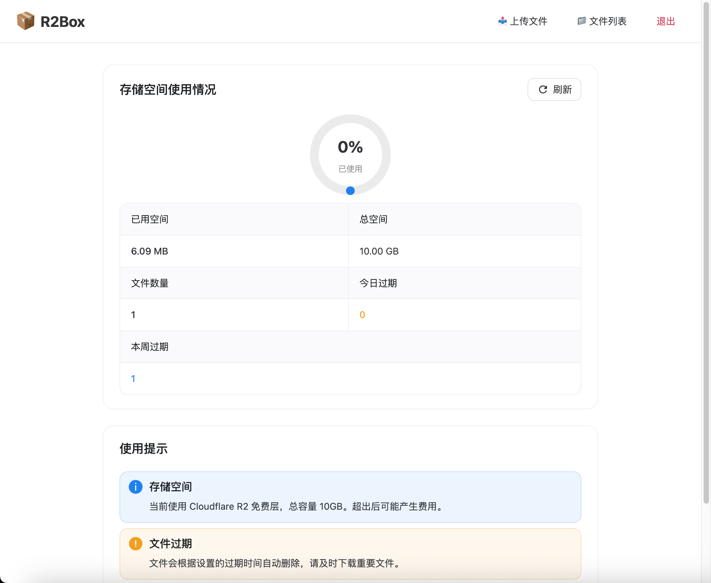
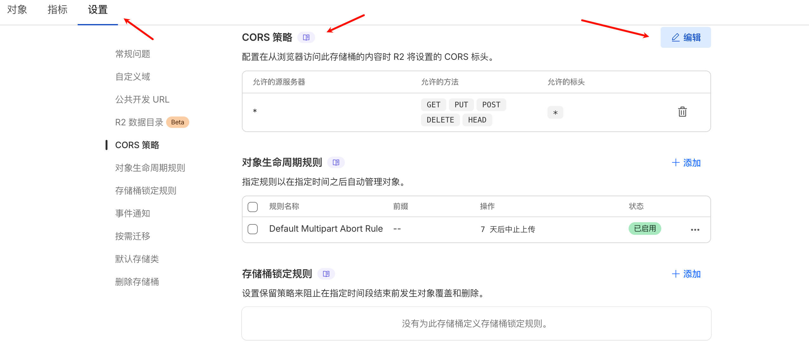

<p align="center">
  
</p>

<h1 align="center">R2Box</h1>

<p align="center">
  基于 Cloudflare R2 的轻量级临时文件分享网盘
</p>

<p align="center">
  <a href="#特性">特性</a> •
  <a href="#快速开始">快速开始</a> •
  <a href="#r2-cors-配置">CORS 配置</a> •
  <a href="#部署指南">部署指南</a> •
  <a href="#常见问题">FAQ</a>
</p>

---

## 简介

R2Box 是一个基于 Cloudflare R2 对象存储的轻量级临时文件分享服务。支持前端直传、大文件分片上传、自动过期清理，适合个人或小团队使用。

## 特性

- **前端直传** - 文件直接上传到 R2，不占用服务器带宽
- **大文件支持** - 支持最大 5GB 文件，自动分片上传
- **自动过期** - 支持 1天/3天/7天/30天 自动删除
- **R2 直链** - 上传完成后直接返回 R2 预签名下载链接
- **密码鉴权** - 首次访问设置密码，无需环境变量配置
- **速率限制** - 防暴力破解，IP 限流保护
- **存储监控** - 实时查看存储空间使用情况
- **轻量部署** - 内存占用仅 ~55MB，适合低配服务器
- **引导配置** - 首次登录后通过 Web 界面配置 R2

## 界面展示

| 首页 | 上传 |
|:---:|:---:|
|  |  |

| 文件列表 | 存储统计 |
|:---:|:---:|
|  |  |

## 快速开始

### 1. 准备 Cloudflare R2

1. 登录 [Cloudflare Dashboard](https://dash.cloudflare.com)
2. 进入 **R2 Object Storage** → 创建存储桶
3. 点击 **Manage R2 API Tokens** → 创建 API Token（权限：Object Read & Write）
4. 记录以下信息：
   - R2 端点 URL：`https://<account_id>.r2.cloudflarestorage.com`
   - Access Key ID
   - Secret Access Key
   - Bucket Name

### 2. 一键部署

```bash
mkdir -p r2box/data && cd r2box
curl -O https://raw.githubusercontent.com/Today-ddr/r2box/master/docker-compose.yml
docker compose up -d
```

### 3. 配置 R2 CORS（必须）

> ⚠️ **重要**：前端直传功能必须配置 CORS，否则上传会失败！

<p align="center">
  
</p>

1. 在 Cloudflare Dashboard 进入你的 R2 存储桶
2. 点击 **Settings（设置）** → 找到 **CORS Policy**
3. 点击 **Edit CORS Policy**，粘贴以下配置：

```json
[
  {
    "AllowedOrigins": ["*"],
    "AllowedMethods": ["GET", "PUT", "POST", "DELETE", "HEAD"],
    "AllowedHeaders": ["*"],
    "ExposeHeaders": ["ETag", "Content-Length", "Content-Type"],
    "MaxAgeSeconds": 3600
  }
]
```

> 💡 生产环境建议将 `*` 改为你的实际域名，详见 [R2 CORS 配置](#r2-cors-配置) 章节。

### 4. 首次配置

1. 访问 `http://your-server-ip:9988`
2. **首次访问会提示设置密码**（密码存储在数据库中）
3. 登录后在 R2 配置向导中填写 R2 信息
4. 测试连接 → 保存配置 → 开始使用！

---

## 部署指南

### 生产环境部署 (Production)

使用 GitHub Container Registry 预构建镜像，推荐用于生产环境。

**配置文件：** `docker-compose.yml`

**镜像源：** `ghcr.io/today-ddr/r2box:latest`

```bash
# 下载配置文件
curl -O https://raw.githubusercontent.com/Today-ddr/r2box/master/docker-compose.yml

# 启动服务
docker compose up -d

# 查看日志
docker compose logs -f

# 更新到最新版本
docker compose pull && docker compose up -d
```

或使用 Docker 命令直接运行：

```bash
docker run -d \
  --name r2box \
  --restart unless-stopped \
  -p 9988:9988 \
  -v ./data:/app/data \
  ghcr.io/today-ddr/r2box:latest
```

### 本地开发部署 (Development)

从源码构建，适用于开发调试和功能测试。

**配置文件：** `docker-compose.dev.yml`

```bash
# 克隆项目
git clone https://github.com/Today-ddr/r2box.git
cd r2box

# 构建并启动（从源码构建）
docker compose -f docker-compose.dev.yml build --no-cache && docker compose -f docker-compose.dev.yml up

# 后台运行
docker compose -f docker-compose.dev.yml up -d

# 停止服务
docker compose -f docker-compose.dev.yml down
```

---

## 环境变量

| 变量名 | 默认值 | 说明 |
|--------|--------|------|
| `PORT` | `9988` | 服务端口 |
| `MAX_FILE_SIZE` | `5368709120` | 单文件大小限制（字节），默认 5GB |
| `TOTAL_STORAGE` | `10737418240` | 总存储空间限制（字节），默认 10GB |
| `DATABASE_PATH` | `/app/data/r2box.db` | SQLite 数据库路径 |

### 配置示例

```yaml
environment:
  - PORT=9988
  - MAX_FILE_SIZE=5368709120           # 5GB
  - TOTAL_STORAGE=10737418240          # 10GB
  - DATABASE_PATH=/app/data/r2box.db
```

---

## 密码管理

### 重置密码

如果忘记密码，可以通过以下命令重置：

```bash
# 删除数据库中的密码记录，下次访问时会提示重新设置
docker exec r2box sh -c "sqlite3 /app/data/r2box.db \"DELETE FROM system_config WHERE key='password_hash';\""

# 或者直接删除数据库文件（会丢失所有数据）
rm ./data/r2box.db
```

重启容器后访问网页即可重新设置密码。

---

## 技术栈

| 组件 | 技术 |
|------|------|
| 后端 | Go 1.21+ |
| 前端 | Vue.js 3 + Naive UI |
| 数据库 | SQLite |
| 存储 | Cloudflare R2 |
| 部署 | Docker |

## 项目结构

```
r2box/
├── backend/                 # Go 后端
├── frontend/                # Vue.js 前端
├── img/                     # 截图
├── Dockerfile               # 多阶段构建
├── docker-compose.yml       # 生产环境配置
├── docker-compose.dev.yml   # 开发环境配置
└── r2-cors.json             # R2 CORS 配置示例
```

---

## R2 CORS 配置

前端直传功能需要在 Cloudflare R2 存储桶中配置 CORS（跨域资源共享）规则。

### 配置步骤

1. 登录 [Cloudflare Dashboard](https://dash.cloudflare.com)
2. 进入 **R2 Object Storage** → 选择你的存储桶
3. 点击 **Settings（设置）** 标签
4. 找到 **CORS Policy** 部分，点击 **Edit CORS Policy**
5. 粘贴下方配置并保存

### 开发/测试环境配置（宽松）

适用于本地开发和测试，允许所有来源访问：

```json
[
  {
    "AllowedOrigins": [
      "*"
    ],
    "AllowedMethods": [
      "GET",
      "PUT",
      "POST",
      "DELETE",
      "HEAD"
    ],
    "AllowedHeaders": [
      "*"
    ],
    "ExposeHeaders": [
      "ETag",
      "Content-Length",
      "Content-Type"
    ],
    "MaxAgeSeconds": 3600
  }
]
```

### 生产环境配置（推荐）

限制只允许你的域名访问，更加安全：

```json
[
  {
    "AllowedOrigins": [
      "https://your-domain.com",
      "https://www.your-domain.com"
    ],
    "AllowedMethods": [
      "GET",
      "PUT",
      "POST",
      "DELETE",
      "HEAD"
    ],
    "AllowedHeaders": [
      "Content-Type",
      "Content-MD5",
      "x-amz-*"
    ],
    "ExposeHeaders": [
      "ETag",
      "Content-Length",
      "Content-Type"
    ],
    "MaxAgeSeconds": 86400
  }
]
```

### 配置说明

| 字段 | 说明 |
|------|------|
| `AllowedOrigins` | 允许访问的域名，`*` 表示所有域名，生产环境建议指定具体域名 |
| `AllowedMethods` | 允许的 HTTP 方法，上传需要 `PUT`/`POST`，下载需要 `GET` |
| `AllowedHeaders` | 允许的请求头，`*` 表示所有，生产环境可限制为必要的头 |
| `ExposeHeaders` | 允许前端访问的响应头，`ETag` 用于分片上传校验 |
| `MaxAgeSeconds` | 预检请求缓存时间（秒），减少 OPTIONS 请求次数 |

> ⚠️ **安全提示**：生产环境强烈建议将 `AllowedOrigins` 设置为你的实际域名，避免使用 `*` 通配符。

---

## 常见问题

<details>
<summary><b>Q: 上传失败？</b></summary>

- 检查 R2 CORS 是否正确配置
- 查看浏览器控制台错误信息
- 确认 R2 API Token 权限为 Object Read & Write

</details>

<details>
<summary><b>Q: 无法访问服务？</b></summary>

- 检查防火墙是否开放 9988 端口
- 运行 `docker compose logs` 查看错误日志
- 确认 Docker 容器正常运行：`docker ps`

</details>

<details>
<summary><b>Q: 如何配置 R2 CORS？</b></summary>

在 R2 存储桶设置中添加 CORS 规则，详细配置请参考上方 [R2 CORS 配置](#r2-cors-配置) 章节。

快速配置（开发环境）：
```json
[
  {
    "AllowedOrigins": ["*"],
    "AllowedMethods": ["GET", "PUT", "POST", "DELETE", "HEAD"],
    "AllowedHeaders": ["*"],
    "ExposeHeaders": ["ETag", "Content-Length", "Content-Type"],
    "MaxAgeSeconds": 3600
  }
]
```

> 💡 生产环境建议将 `AllowedOrigins` 改为你的实际域名。

</details>

<details>
<summary><b>Q: 忘记密码怎么办？</b></summary>

参考上方 [密码管理](#密码管理) 章节，使用 Docker 命令重置密码。

</details>

---

## 许可证

[MIT License](LICENSE)

## 功能状态

### ✅ 已完成

- [x] 前端直传 R2（预签名 URL）
- [x] 大文件分片上传（支持 5GB）
- [x] 文件自动过期清理（1/3/7/30 天）
- [x] R2 预签名下载直链
- [x] 首次访问设置密码（无需环境变量）
- [x] 密码重置功能（Docker 命令）
- [x] IP 速率限制 & 暴力破解防护
- [x] 存储空间使用统计
- [x] 文件短链接分享
- [x] Web 界面 R2 配置向导
- [x] Docker 一键部署
- [x] 上传历史记录

### 🚧 待完成

- [ ] 核实真实 R2 存储用量（当前为本地数据库累加）
- [ ] 文件批量上传
- [ ] 文件预览（图片/视频）
- [ ] 自定义过期时间
---

## 贡献

欢迎提交 Issue 和 Pull Request！
